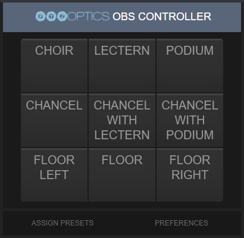
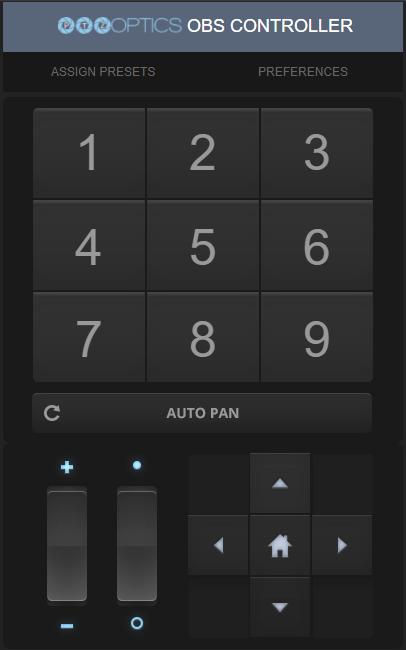
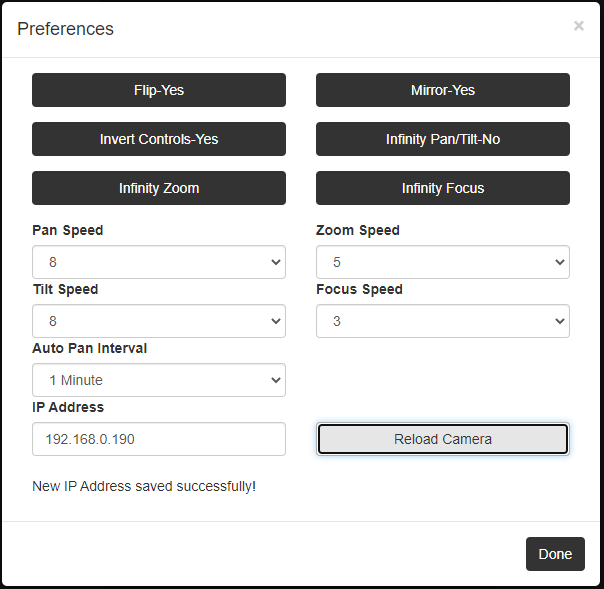
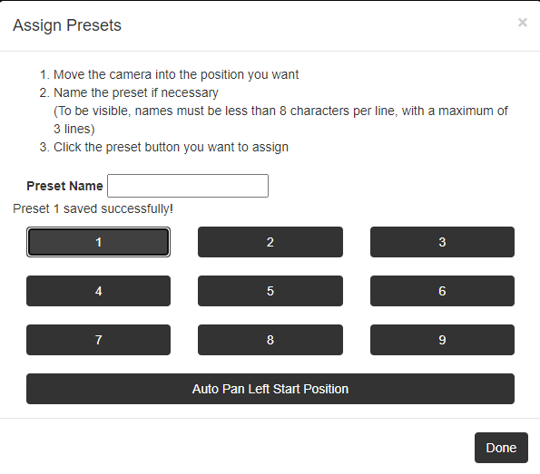

# PTZOptics-OBS-named-presets
DISCLAIMER: This is completely built on the existing PTZoptics Dockable OBS controllers. The vast majority of the code is ripped directly from PTZOptics.

For install instructions, download the repository, and follow the guide PDF.

The main purpose of these two controllers is to allow the user to easily rename presets, instead of having crude images that cannot be easily edited or changed. While setting up a system at a church, I realized there was a need to rename the presets, but with operators that were not super techy, I couldn't tell them "hey, just go to the install folder, remake a .png image, and then save it with the exact file name, or go and change the html code." 

Instead, I changed the medium version (with 9 images) and the large version (giving it the same size presets as the 9 image medium controller), as those are the ones that use the annoying images, and now they look like the image below (of the medium controller).

The controllers will install with the names defaulted to just be the number (shown in the image of the large controller below), but these can be renamed to anything the user wants. However, space is limited to three lines of text, with about 8 characters per line. Is the name is set back to the preset number, the style will revert back to the original large number.

Additionally, I have fixed a bug where the preset would continue to be displayed as active even after another preset is clicked, and changed the appearance of the active preset. 

Another issue, perhaps not necessarily a bug, but still annoying, was the fact that all the controllers, even for different cameras, referenced the same configuration. This may not have been an issue in OBS, as I'm unsure how OBS browser sources handle that, but I have changed it to save a different configuration for each camera, so these controllers could be used in any browser now, not just in OBS.

Instead of using alerts for user notification, the notifications for IP address saved and Preset saved are now displayed on the HTML (both shown below).

 

This is quite literally my first programming project. I learned HTML, javascript, and CSS for this project, so by all means, leave any feedback or suggestions that you have, as there are very likely issues with my code.
